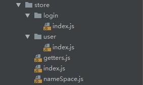
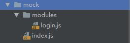

#### 1.输入命令行vue init webpack vue-router-active-project
      (该操作需要全局安装vue-cli)

#### 2.在项目目录中安装项目相关的依赖文件( npm install )

#### 3.清空src目录( 附文件目录图 )

#### 4.重新创建vue项目所必需的目录和文件等
* 创建main.js
  ```
  //引入vue的核心库
  import Vue from 'vue' ;
  //引入路由实例对象
  import router from './router' ;
  //引入根组件
  import App from './App.vue' ;

  //关闭vue的警告信息提示
  Vue.config.productionTip = false ;

  export default new Vue( {
    router,
    render: h => h( App )
  } ).$mount( '#app' )
  ```
* 创建router目录 router.js ( *_import.js )
  ```
  //引入vue核心库
  import Vue from 'vue' ;
  //引入vue-router 核心库
  import Router from 'vue-router' ;

  //引入动态引入对应组件的方法
  export const _import = require( './_import.' + process.env.NODE_ENV ) ;

  //声明使用vue-router插件
  Vue.use( Router ) ;

  //创建路由对象集合
  const routes = [
    {
      path: '/',
      redirect: '/home'
    },
    {
      path: '/login',
      component: _import( 'login' )
    },
    {
      path: '/home',
      component: _import( 'home' )
    }
  ] ;
  export default new Router( {
    routes
  } )

  ```
  ```
  //_import.development.js
  module.exports = file => {
    try {
      return require( '@/views/' + file ).default ;
    } catch (e) {
      console.log( e ) ;
      return require( '@/views/errorPage/404.vue' ).default ;
    }
  } ;
  ```

* 创建views( 对应所需要渲染的组件文件夹 )

  

* 创建App.vue ( 用户渲染vue实例的根组件 )
  ```
  <template>
      <router-view></router-view>
  </template>

  <script>
      export default {
          name: "App"
      }
  </script>

  <style scoped>

  </style>

  ```
#### 5.到目前为止是成功创建了一个简单的vue项目

#### 6.使用vuex进行状态管理
* npm install vuex --save -dev 安装vuex的相关依赖等

* 创建对应的store文件夹及相关目录文件作为vuex的配置文件

  
  * index 核心文件 用于创建vuex实例对象并在创建时传入对应的modules对象
  ```
  //引入vue核心库
  import Vue from 'vue' ;
  //引入vuex核心库
  import Vuex from 'vuex' ;

  //引入我们定义的对应的模块
  import user from './user' ;
  import login from './login' ;
  //引入对应的getters
  import getters from './getters' ;

  //声明使用vuex
  Vue.use( Vuex ) ;

  //暴露对应的vuex实例对象
  export default new Vuex.Store( {
    modules: {
      user,
      login
    },
    getters
  } )
  ```
  * 在对应的模块中 我们是按照对应的功能或对应的类型加以区分并同一维护
  ##### login模块
  ```
  //引入对应发送请求通信的方法
  import { loginByUsername, getUserInfoByToken } from "../../api/login" ;
  //引入了命名空间的变量属性
  import { SET_TOKEN, SET_ROLES } from '../nameSpace' ;
  //引入了保存服务器返回token值的工具类方法
  import { saveToken } from "../../util/auth" ;
  //引入了vue-router实例对象
  import router from '../../router' ;

  //将当前模块暴露
  export default {
    //当前模块中存储的对应的state对象
    state: {
      //token值 初始为空串
      token: '',
      //用户名
      username: '',
      //角色列表 初始值为空
      roles: []
    },
    mutations: {//定义不同的mutation 用于改变上述中对应的属性的值
      [ SET_TOKEN ]( state, token ) {
        state.token = token ;
        saveToken( token ) ;
      },
      [ SET_ROLES ]( state, roles ) {
        state.roles = roles ;
      }
    },
    actions: {
      loginByUsername( { commit, dispatch }, userInfo ) {
        //获取到用户输入的账号和用户名
        const { username, password } = userInfo ;
        //对是否为空进行验证 如果没有传入 那么将直接返回
        if ( !username || !password ) return alert( '请输入正确的账号密码后重试' ) ;
        //通过用户的输入进行请求的通信
        loginByUsername( { username: 'admin' } )
          //获取返回的数据
          .then( res => {
            //获取到token和角色列表
            const { token, roles } = res ;
            //将当前的token保存在状态管理中
            commit( SET_TOKEN, token ) ;
            //根据当前的角色信息生成对应的可访问的路由菜单列表
            dispatch( 'addRoutes', roles[ 0 ] ) ;
            //将当前的角色信息保存在状态管理中
            commit( SET_ROLES, roles ) ;
            //然后进行路由的跳转 跳转到主页界面中
            router.push( '/home' )
          } )
          .catch( err => console.log( err ) )
      },
      //通过token进行通信并拉取到对应的用户的角色信息
      getUserInfoByToken( { commit, dispatch }, token ) {
        return new Promise( ( resolve, reject ) => {
          //对token值是否为空进行判定 如果传入的token为空 那么直接返回
          if ( !token ) reject( 'token值不能为空' ) ;
          //发送请求拉取到对应的角色信息
          getUserInfoByToken( { token } )
            .then( res => {
              //获取到对应的数据
              const { token, roles } = res ;
              //同理 保存到全局的状态管理中
              commit( SET_TOKEN, token ) ;
              //生成对应的路由菜单列表
              dispatch( 'addRoutes', roles[ 0 ] ) ;
              //保存当前的角色到状态管理中
              commit( SET_ROLES, roles ) ;
              //调用resolve进入下一步流程
              resolve() ;
            } )
        } )
      }
    }
  }
  ```
  * * *
  ##### user模块
  ```
  //引入对应的命名空间中的属性名称
  import { SET_ROUTES } from "../nameSpace" ;
  //引入路由实例对象 以及预先定义好的动态路由列表
  import router, { activeRoutes } from "../../router" ;
  //引入路由菜单过滤的工具类函数
  import { filterRoutes } from "../../util/auth" ;

  export default {
    state: {
      routes: []
    },
    mutations: {
      [ SET_ROUTES ]( state, routes ) {
        state.routes = routes ;
      }
    },
    actions: {
      /*
      递归调用进行数组的过滤 将有对应权限的路由对象返回
      export function filterRoutes(routes, role) {
        if ( routes && routes.length ) {
          return routes.filter( item => {
            if ( item.children && item.children.length ) {
              filterRoutes( item.children, role ) ;
            }
            return item.meta.roles.indexOf( role ) !== -1 ;
          } )
        }
        return [] ;
      }
      */
      addRoutes( { commit }, role ) {
        //通过调用过滤的工具类函数 对动态的路由菜单进行筛选
        const routes = filterRoutes( activeRoutes, role ) ;
        //将生成之后的数组对象保存在状态管理中
        commit( SET_ROUTES, routes ) ;
        //调用路由实例对象addRoutes方法 动态添加可访问的路由列表
        router.addRoutes( routes ) ;
      }
    }
  }
  ```
  ##### getters模块
  ```
  //即就是通过动态获取到状态管理中的对应的属性
  export default {
    token: state => state.user.token,
    roles: state => state.login.roles
  }
  ```

  ##### nameSpace模块
  ```
  export const SET_TOKEN = 'SET_TOKEN' ;
  export const SET_ROLES = 'SET_ROLES' ;
  export const SET_ROUTES = 'SET_ROUTES' ;
  ```
* 在main.js中引入vuex所生成的实例对象 并将其通过store属性注册到vue实例的属性中

  ```
  //引入vuex实例对象
  import store from './store' ;

  export default new Vue( {
    router,
    store,//-----将对应的vuex实例对象添加到生成vue实例的配置对象中
    render: h => h( App )
  } ).$mount( '#app' )
  ```

#### 7.修改login.vue组件
  ```
  <template>
      <div>
        <label for="username">用户名:</label>
        <input type="text"
               id="username"
               v-model="form.username">
        <br>
        <label for="password">密码:</label>
        <input type="password"
               id="password"
               v-model="form.password">
        <br>
        <button @click="loginByUsername( form )">点击登录</button>
      </div>
  </template>

  <script>
      //引入对应的actions列表
      import { mapActions } from 'vuex' ;
      export default {
          name: "login",
        data() {
            return {
              form: {
                username: '',
                password: ''
              }
            }
        },
        methods: {
          ...mapActions( [ 'loginByUsername' ] )
        }
      }
  </script>

  <style scoped>

  </style>

  ```
#### 8.在login.vue中调用全局的登录的方法

#### 9.封装axios发送请求的公共组件实例

* npm install axios --save -dev 安装axios的相关依赖等

* 创建对应的request.js文件暴露axios实例对象 并对发送请求的参数 以及返回数据的处理进行公共部分的抽取
  ```
  //引入axios的依赖包
  import axios from 'axios' ;
  import { paramsMethod } from "./auth" ;

  //调用axios的create方法 生成对应的请求公共的请求方法
  const service = axios.create( {
    baseURL: process.env.BASE_API,
    timeout: 4000
  } ) ;

  /*
  //拦截当前的发送请求
  //并修改对应的请求参数的数据结构
  //即通过请求对参数的重写 让其每次请求时带上对应的参数和token值
  export function paramsMethod(url, data) {
    return JSON.stringify( {
      url,
      token: getToken() || '',
      data
    } )
  }
  */

  service.interceptors.request.use( config => {
    return Object.assign( config, {
      data: paramsMethod( config.url.replace( config.baseURL, '' ), config.data )
    } ) ;
  }, err => {
    console.log( err ) ;
    Promise.reject( err ) ;
  } ) ;

  service.interceptors.response.use( response => {
    //在这里对返回的数据进行统一的处理
    return response.data ;
  }, err => {
    console.log( err ) ;
    Promise.reject( err ) ;
  } ) ;

  export default service ;

  ```
#### 10.创建对应的api目录 并定义对应的请求函数

  
  ```
  import request from '../../util/request' ;

  export function loginByUsername(data) {
    return request( {
      url: '/login/loginByUsername',
      method: 'post',
      data
    } )
  }
  export function getUserInfoByToken(data) {
    return request( {
      url: '/login/getUserInfoByToken',
      method: 'post',
      data
    } )
  }
  ```


#### 11.引入mockJs模块 用户模拟请求数据的真实环境

* npm install mock --save -dev 安装mockjs的相关依赖等

* 创建mock目录 引入mockjs核心模块 并创建相关请求的规则 书写匹配请求url的正则表达式
  

  ##### mock/index.js 核心模块文件
  ```
  //引入mockJs 核心依赖包
  import Mock from 'mockjs' ;
  //引入对应的处理请求的方法对象
  import loginApi from './modules/login.js'

  //调用mock方法来匹配请求 对匹配成功的请求(通过参数一的正则表达式进行匹配)进行拦截
  //对匹配成功的请求调用对应请求处理对象中的对应方法 通过该方法返回对应的数据 模拟真实的通信过程
  Mock.mock( /\/login\/loginByUsername/, 'post', loginApi.loginByUsername ) ;

  Mock.mock( /\/login\/getUserInfoByToken/, 'post', loginApi.getUserInfoByToken ) ;

  //最后暴露mock的实例对象
  export default Mock ;
  ```
  ##### modules/login.js

  ```
  //定义一个包含用户信息的对象(模拟)
  const userMap = {
    admin : {
      roles: ['admin'],
      token: 'admin',
      introduction: '我是超级管理员',
      avatar: 'https://wpimg.wallstcn.com/f778738c-e4f8-4870-b634-56703b4acafe.gif',
      name: 'Super Admin'
    }
  } ;

  //最后默认暴露一个事件处理的对象
  //通过外部的mock访问时候进行调用
  export default {
    loginByUsername: config => {
      //定义用户进行用户名进行登录时候返回的数据
      //即返回对应的用户的用户信息
      const { username } = JSON.parse( config.body ).data ;
      return userMap[ username ] ;
    },
    getUserInfoByToken: config => {
      //定义用户进行token登录时候返回的数据
      //即通过token查找 返回对应的用户信息等
      const { token } = JSON.parse( config.body ).data ;
      return userMap[ token ] ;
    }
  }
  ```
* 在main.js中引入对应的mock的模块
  ```
  //引入mockJS 模拟获取返回数据
  import './mock' ;
  ```

#### 12.模拟发送请求获取到对应的token值 以及当前的角色列表 并将其保存在缓存
* 调用api文件夹下的对应请求函数获取到对应的数据( 模拟返回的token值 角色信息等 )

* 将获取到的token值更新到全局的状态管理中 并将其保存在本地的缓存
  ```
  loginByUsername( { commit, dispatch }, userInfo ) {
        //获取到用户输入的账号和用户名
        const { username, password } = userInfo ;
        //对是否为空进行验证 如果没有传入 那么将直接返回
        if ( !username || !password ) return alert( '请输入正确的账号密码后重试' ) ;
        //通过用户的输入进行请求的通信
        loginByUsername( { username: 'admin' } )
          //获取返回的数据
          .then( res => {
            //获取到token和角色列表
            const { token, roles } = res ;
            //将当前的token保存在状态管理中
            commit( SET_TOKEN, token ) ;
            //根据当前的角色信息生成对应的可访问的路由菜单列表
            dispatch( 'addRoutes', roles[ 0 ] ) ;
            //将当前的角色信息保存在状态管理中
            commit( SET_ROLES, roles ) ;
            //然后进行路由的跳转 跳转到主页界面中
            router.push( '/home' )
          } )
          .catch( err => console.log( err ) )
      }
  ```

#### 13.通过请求获取的对应的token值生成对应的可访问的路由列表
  ```
  export function filterRoutes(routes, role) {
    if ( routes && routes.length ) {
      return routes.filter( item => {
        if ( item.children && item.children.length ) {
          filterRoutes( item.children, role ) ;
        }
        return item.meta.roles.indexOf( role ) !== -1 ;
      } )
    }
    return [] ;
  }
  ```
* 通过调用封装的过滤路由菜单的列表 并调用router实例对象的addRoutes方法 将其添加到对应的路由对象中

#### 14.对每次的路由跳转进行拦截 如果没有对应的权限那么跳转404界面()

  ```
  //引入路由实例对象
  import router from './router' ;
  //引入获取token的方法
  import { getToken } from "./util/auth";
  //引入vuex实例对象
  import store from './store' ;

  //定义白名单列表 即不需要token也能进入的路由列表
  const whiteList = [ '/login', '/403', '/404' ] ;

  //调用router的beforeEach对每次的路由跳转进行拦截
  router.beforeEach( ( to, from, next ) => {
    //判定当前是否有token值
    if ( getToken() ) {
      //再判定当前是否有对应的角色信息
      if ( store.getters.roles.length ) {
        if ( to.meta.roles && to.meta.roles.length ) {
          //判定当前角色是否有药跳转的路由对象的权限
          if ( to.meta.roles.indexOf( store.getters.roles[ 0 ] ) !== -1 ) {
            //有权限 那么成功跳转
            next()
          } else {
            //todo: 本段逻辑永远不会被执行
            //因为我们对未定义的路由对象进行了优化 即通过*跳转404页面中
            //所以 如果当没有角色信息时候会直接匹配到404的页面中 并不会进入本次逻辑中
            //待改善


            //如果没有对应的权限 那么跳转403界面
            next( '/403' )
          }
        } else {
          //如果当前要跳转的路由对象没有对应的角色要求 那么说明该菜单不需要进行权限验证
          //进行成功跳转
          next() ;
        }
      } else {//如果当前的用户没有对应的角色列表
        //调用token获取角色信息的方法
        store.dispatch( 'getUserInfoByToken', getToken() )
          .then( () => {
            //调用之后获取到对应的角色信息
            if ( to.meta.roles && to.meta.roles.length ) {
              //同理 判定当前要跳转的路由对象是否有跳转的权限要求
              if ( to.meta.roles.indexOf( store.getters.roles[ 0 ] ) !== -1 ) {
                //如果有权限要求 切当前的角色具备权限要求
                //那么就成功跳转
                next()
              } else {
                //如果没有对应的权限 那么跳转404界面
                //todo: 同理 本段逻辑不会被正常值执行
                next( '/404' )
              }
            } else {
              //通过rank不断跳转 确保当前新生成的路由对象添加到vue实例对象中
              next( { ...to, replace: true } ) ;
            }
          } )
          .catch( err => {
            //如果获取角色信息失败 那么就跳往登录页面进行重新登录
            console.log( err ) ;
            next( '/login' ) ;
          } )
      }
    } else {//如果当前没对应的token值
      //那么判定当前要跳转的页面是否在白名单中
      //如果在白名单中 那么成功跳转
      if ( whiteList.indexOf( to.path ) !== -1 ) next() ;
      //如果没有在白名单中 那么就将其都重定向到登录路由中
      next( '/login' ) ;
    }
  } ) ;

  ```

* * *
总而言之 前端的权限验证是通过vue-router的addRoutes来进行实现的 前端在定义一个具有权限要求的动态路由列表

在初始化路由实例对象的时候并不会将这些路由菜单添加到routes的对应数组列表中 而是在用户进行登录之后 获取到对应的

角色之后 而通过这个角色和动态路由中的路由对象中的角色正常匹配而生成的 然后再通过调用vue-router实例方法的beforeEach钩子

函数对每次跳转进行拦截和验证 如果当前要跳转的路由对象中的角色要求和当前的角色不能正常匹配则通过形参注入的next方法进行

重定向或终止等

* * *

待优化的问题: 

但是当前的整套项目并没有办法区分要跳转的路由对象是无权限或者是404未定义 因为我们是在获取角色列表的同时生成了对应的菜单

没有被生成的菜单即可能是没有对应的权限访问 但是当添加完毕之后 两者之间并没有建立对应的映射关系 所以当前没有办法区分

在后期需要进行更正
