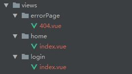

#### 1.输入命令行vue init webpack vue-router-active-project
      (该操作需要全局安装vue-cli)

#### 2.在项目目录中安装项目相关的依赖文件( npm install )

#### 3.清空src目录( 附文件目录图 )

#### 4.重新创建vue项目所必需的目录和文件等
* 创建main.js
  ```
  //引入vue的核心库
  import Vue from 'vue' ;
  //引入路由实例对象
  import router from './router' ;
  //引入根组件
  import App from './App.vue' ;

  //关闭vue的警告信息提示
  Vue.config.productionTip = false ;

  export default new Vue( {
    router,
    render: h => h( App )
  } ).$mount( '#app' )
  ```
* 创建router目录 router.js ( *_import.js )
  ```
  //引入vue核心库
  import Vue from 'vue' ;
  //引入vue-router 核心库
  import Router from 'vue-router' ;

  //引入动态引入对应组件的方法
  export const _import = require( './_import.' + process.env.NODE_ENV ) ;

  //声明使用vue-router插件
  Vue.use( Router ) ;

  //创建路由对象集合
  const routes = [
    {
      path: '/',
      redirect: '/home'
    },
    {
      path: '/login',
      component: _import( 'login' )
    },
    {
      path: '/home',
      component: _import( 'home' )
    }
  ] ;
  export default new Router( {
    routes
  } )

  ```
  ```
  //_import.development.js
  module.exports = file => {
    try {
      return require( '@/views/' + file ).default ;
    } catch (e) {
      console.log( e ) ;
      return require( '@/views/errorPage/404.vue' ).default ;
    }
  } ;
  ```

* 创建views( 对应所需要渲染的组件文件夹 )

  
* 创建App.vue ( 用户渲染vue实例的根组件 )
  ```
  <template>
      <router-view></router-view>
  </template>

  <script>
      export default {
          name: "App"
      }
  </script>

  <style scoped>

  </style>

  ```
#### 5.到目前为止是成功创建了一个简单的vue项目

#### 6.使用vuex进行状态管理
* npm install vuex --save -dev 安装vuex的相关依赖等

* 创建对应的store文件夹及相关目录文件作为vuex的配置文件

* 在main.js中引入vuex所生成的实例对象 并将其通过store属性注册到vue实例的属性中

#### 7.修改login.vue组件

#### 8.在login.vue中调用全局的登录的方法

#### 9.封装axios发送请求的公共组件实例

* npm install axios --save -dev 安装axios的相关依赖等

* 创建对应的request.js文件暴露axios实例对象 并对发送请求的参数 以及返回数据的处理进行公共部分的抽取

#### 10.创建对应的api目录 并定义对应的请求函数

#### 11.引入mockJs模块 用户模拟请求数据的真实环境

* npm install mock --save -dev 安装mockjs的相关依赖等

* 创建mock目录 引入mockjs核心模块 并创建相关请求的规则 书写匹配请求url的正则表达式

* 在main.js中引入对应的mock的模块

#### 12.模拟发送请求获取到对应的token值 以及当前的角色列表 并将其保存在缓存
* 调用api文件夹下的对应请求函数获取到对应的数据( 模拟返回的token值 角色信息等 )

* 将获取到的token值更新到全局的状态管理中 并将其保存在本地的缓存
